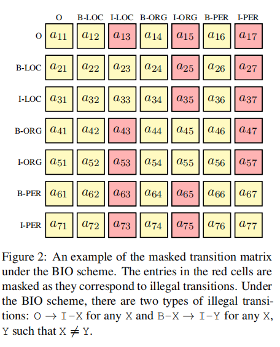

# Introduction
Conditional Random Field (CRF) based neural models are among the most performant methods for solving sequence labeling problems. Despite its great success, CRF has the short- coming of occasionally generating illegal sequences of tags, e.g. sequences containing an
“I-” tag immediately after an “O” tag, which is forbidden by the underlying BIO tagging scheme. 
To tackle this problem, we propose Masked Conditional Random Field (Masked-CRF), an easy to implement variant CRF that masks illegal transitions during CRF training, eliminating illegal outcomes in a principled way.

The algorithm for our Masked CRF approach:


An example of the masked transition matrix:



An comparison of the decoded path for CRF / Masked CRF:


More details can be found in our paper:

[Masked Conditional Random Fields for Sequence Labeling](https://arxiv.org/abs/2103.10682)


# Train and Evaluate
This example code `grid_search.sh` fine-tunes Bert + Masked-CRF on RESUME data sets.

`train_mask`: whether to use Masked-CRF during training

`eval_mask`: whether to use Masked-CRF during evaluating

`lr_decay`: control the learning rate for each layer


For BIO format data file, such as `Resume`
```bash
for lr in '5e-5' '2e-5' '1e-5'
do
    for decay in '1.0' '0.75' '0.5'
    do
        for i in 0 1 2
        do
            python train_and_eval.py \
                --bert_config_file=conf/bert_config.json \
                --init_checkpoint=model/roberta/bert_model.ckpt \
                --train_file=data/resume/train.char.bio \
                --dev_file=data/resume/dev.char.bio \
                --test_file=data/resume/test.char.bio \
                --data_format=bio \
                --max_seq_length=128 \
                --epoch_num=3 \
                --train_batch_size=32 \
                --vocab_file=conf/vocab.txt \
                --do_lower_case=True \
                --output_dir=model/resume-grid-search/lr-${lr}-decay-${decay}-ex-${i} \
                --min_train_steps=10000 \
                --learning_rate=${lr} \
                --train_mask=True \
                --eval_mask=True \
                --lr_decay=${decay} \
                --gpu_idx=3
        done
    done
done
```

After training, `summary.py` will summarize the results as follow:

```text
Max dev: 96.34
Max test: 97.44
Max dev's test: 97.05
```

# Performance
The baseline models are the following:
* BERT-tagger: The output of the final hidden representation of BERT for to each token is fed into a classification layer over the label set without using CRF.
* BERT-CRF: BERT followed by a conventional CRF layer.
* Retain: Keep and retag the illegal segments.
This strategy agrees with ([Sang et al., 2000](https://www.aclweb.org/anthology/W00-0726/)).
* Discard: Discard the illegal segments completely.
* MCRF-decoding: A naive version of MCRF
that does masking only in decoding. The training process is the same as that in conventional
CRF.
* MCRF-training: The proper MCRF approach proposed in this work. The masking is
maintained in the training

|  Task   |  Bert-Softmax-Retain  |  Bert-Softmax-Discard  |  Bert-CRF-Retain  |  Bert-CRF-Discard  |  Bert-MCRF-Decoding  |  Bert-MCRF-Training  |
|  ----  | ----  | ---- | ---- | ---- | ----  | ---- |
| Resume | 95.7 | 96.2 | 95.9 | 97.2 | 97.3 | 97.6 |
| MSRA | 94.0 | 94.6 | 94.2 | 95.5 | 95.6 | 95.9 |
| Ontonotes | 78.1 | 80.7 | 81.8 | 83.1 | 83.2 | 83.7 |
| Weibo | 67.7 | 69.7 | 70.8 | 71.9 | 72.2 | 72.4 |
| ATIS | 95.2 | 95.6 | 95.5 | 95.8 | 95.8 | 95.9 |
| SNIPS | 93.2 | 93.5 | 94.6 | 95.1 | 95.1 | 95.3 |
| CoNLL2000 | 96.1 | 96.3 | 96.5 | 96.6 | 96.6 | 96.9 |
| CoNLL2003 | 90.1 | 90.4 | 90.4 | 90.6 | 91.2 | 91.7 |


# Citation
````
@inproceedings{wei-etal-2021-masked,
    title = "Masked Conditional Random Fields for Sequence Labeling",
    author = "Wei, Tianwen  and
      Qi, Jianwei  and
      He, Shenghuan  and
      Sun, Songtao",
    booktitle = "Proceedings of the 2021 Conference of the North American Chapter of the Association for Computational Linguistics: Human Language Technologies",
    month = jun,
    year = "2021",
    address = "Online",
    publisher = "Association for Computational Linguistics",
    url = "https://www.aclweb.org/anthology/2021.naacl-main.163",
    pages = "2024--2035",
    abstract = "Conditional Random Field (CRF) based neural models are among the most performant methods for solving sequence labeling problems. Despite its great success, CRF has the shortcoming of occasionally generating illegal sequences of tags, e.g. sequences containing an {``}I-{''} tag immediately after an {``}O{''} tag, which is forbidden by the underlying BIO tagging scheme. In this work, we propose Masked Conditional Random Field (MCRF), an easy to implement variant of CRF that impose restrictions on candidate paths during both training and decoding phases. We show that the proposed method thoroughly resolves this issue and brings significant improvement over existing CRF-based models with near zero additional cost.",
}
````
